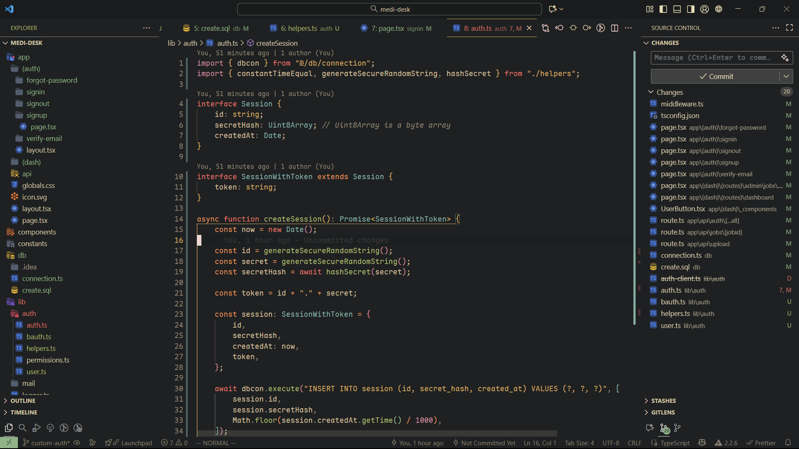

# Cosmic-Gleam

Experience the Noctis theme, a sophisticated blend of Catppuccin Mocha inspiration and a subtle cosmic aesthetic. Enjoy enhanced readability and a calming, productive coding environment.

Available for both **VS Code** and **Neovim**!

## Installation

### VS Code

1. Install the theme from the [VS Code Marketplace](https://marketplace.visualstudio.com/items?itemName=srshah.cosmic-gleam)
2. Press `Ctrl+K Ctrl+T` (or `Cmd+K Cmd+T` on Mac) and select your preferred Cosmic Gleam theme

### Neovim

For detailed Neovim installation and configuration instructions, see [NEOVIM_README.md](NEOVIM_README.md).

Quick install with [lazy.nvim](https://github.com/folke/lazy.nvim):

```lua
{
  "snehilshah/cosmic-gleam",
  lazy = false,
  priority = 1000,
  config = function()
    vim.cmd.colorscheme("cosmic-gleam-noctis")
  end,
}
```

### Recommended Settings (VS Code)

For the best experience, add this to your `settings.json` to dim the final empty line numbers:

```json
{
  "editor.renderFinalNewline": "dimmed"
}
```

## Available Themes

All themes are available in both VS Code and Neovim:

- **Noctis 🦉** - Sophisticated Catppuccin Mocha-inspired theme
- **Catbox 📻** - Warm Gruvbox-inspired theme  
- **Zen High Contrast 🌚** - High contrast theme for maximum readability

## Previews

<details>
  <summary>Noctis 🦉</summary>
  
</details>

<br />

<details>
  <summary>Gruvbox 📻</summary>
  
</details>

<br />

<details>
  <summary>Zen High Contrast 🌚</summary>
  
</details>
